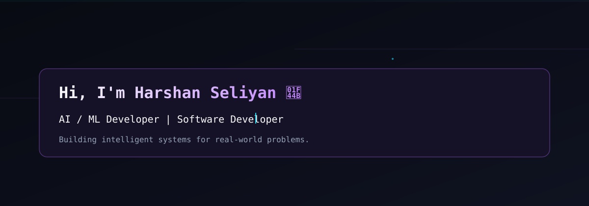
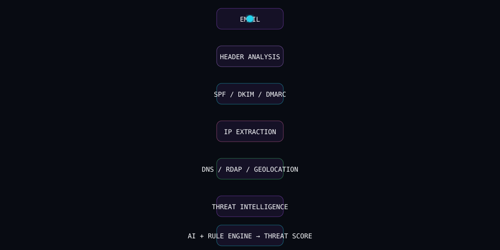
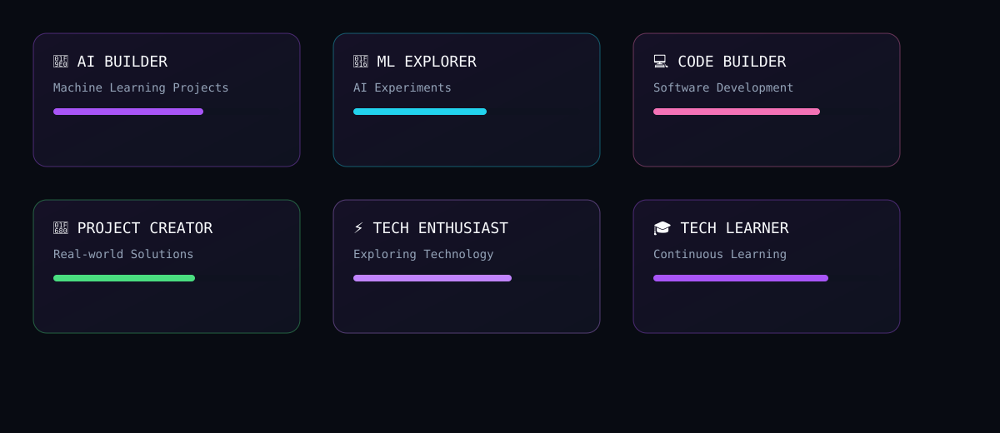

# AI DEVELOPER // DIGITAL INNOVATION

<p align="center">
  
</p>

---

### Terminal

```bash
harshan@dev:~$ whoami
AI / ML Developer
Software Developer
Technology Explorer

harshan@dev:~$ current_focus
Artificial Intelligence
Machine Learning
Software Development
```

---

### About Me

> I enjoy exploring technology, understanding how systems work, and turning ideas into practical solutions.

- 🎓 B.Tech Information Technology
- 🤖 Exploring AI & Machine Learning
- 💻 Building software solutions
- 🧠 Learning new technologies
- 🚀 Turning ideas into real-world projects
- ⚡ Improving every day

---

### Technology Stack

**LANGUAGES**  
Python • C++ • Java • JavaScript

**FRONTEND**  
React • HTML • CSS

**BACKEND**  
FastAPI • REST APIs

**DATABASE**  
MongoDB • SQL

**AI / ML**  
Machine Learning • Deep Learning • Artificial Intelligence

**TOOLS**  
Git • GitHub • Linux • VS Code

---

### Featured Project — FORENSIC AI

<p align="center">
  
</p>

**🛡️ FORENSIC AI**  
*AI-Powered Email Threat Detection, Geolocation & Forensic Intelligence Platform*

> An AI-powered platform that analyzes suspicious emails, examines email headers, evaluates authentication signals, extracts network intelligence, and generates a forensic threat assessment.

**Features**
- Phishing email detection
- Email header analysis
- SPF / DKIM / DMARC verification
- RFC 5322 header parsing
- IP extraction & IP geolocation
- WHOIS / RDAP intelligence
- DNS intelligence
- Received-chain reconstruction
- Threat scoring
- URL threat analysis
- AI + rule-based detection

[🚀 Repository](YOUR_FORENSIC_AI_REPOSITORY_URL)

---

### Achievements

<p align="center">
  
</p>

---

### GitHub Statistics

<p align="center">
  
  
</p>

<p align="center">
  
</p>

---

### Contribution Snake

🐍 Watch the snake explore my contributions

<p align="center">
  
</p>

*Snake generated by `.github/workflows/snake.yml`. Replace `github_user_name` with your username if needed.*

---

### Currently Learning

- AI / ML — Exploring
- Software Development — Learning
- Backend Engineering — Building
- Deep Learning — Improving
- Cloud Technologies — Exploring
- Automation — Building

---

### How I Think

**OBSERVE → ANALYZE → BUILD → TEST → IMPROVE**

> Observe real-world problems. Analyze the underlying system. Build practical solutions. Test against real scenarios. Continuously improve.

---

### Connect With Me

- GitHub: [YOUR_GITHUB_URL](YOUR_GITHUB_URL)
- LinkedIn: [YOUR_LINKEDIN_URL](YOUR_LINKEDIN_URL)
- Email: [YOUR_EMAIL](mailto:YOUR_EMAIL)
- Portfolio: [YOUR_PORTFOLIO_URL](YOUR_PORTFOLIO_URL)

---

<p align="center">
  
</p>

---

*My Goal: Build intelligent technology that makes complex problems simple.*
